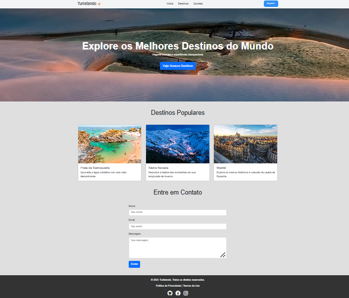
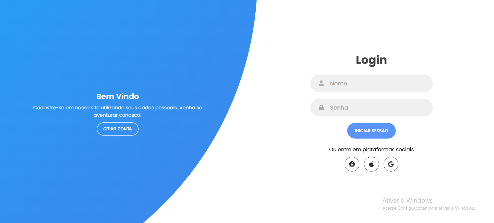
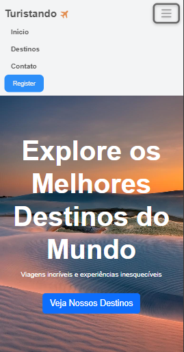
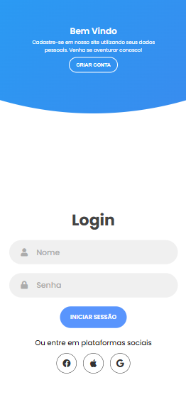

<h1 align="center">
  Projeto UFCD 5425 Turistando
</h1>

  <a href="#-tecnologias">Tecnologias</a>&nbsp;&nbsp;&nbsp;|&nbsp;&nbsp;&nbsp;
  <a href="#-projeto">Projeto</a>&nbsp;&nbsp;&nbsp;|&nbsp;&nbsp;&nbsp;
  <a href="#memo-licença">Licença</a>

 

  

 

<h1>Desktop</h1>

  
    

<h1>Mobile</h1>

  
  

## 🚀 Tecnologias

Esse projeto será desenvolvido com as seguintes tecnologias:

- HTML
- CSS
- Javascript
- Bootstrap

## 🚧 Projeto

Este projeto tem como fim desenvolver um site de agência de turismo, com o objetivo de ajudar as pessoas a buscar lugares para viajar.

## 🎨 Inspiração:

[Dribbble](https://dribbble.com/tags/travel-lading-page)

## :memo: Licença

Esse projeto está sob a licença MIT. Veja o arquivo [LICENSE](.github/LICENSE) para mais detalhes.

---
